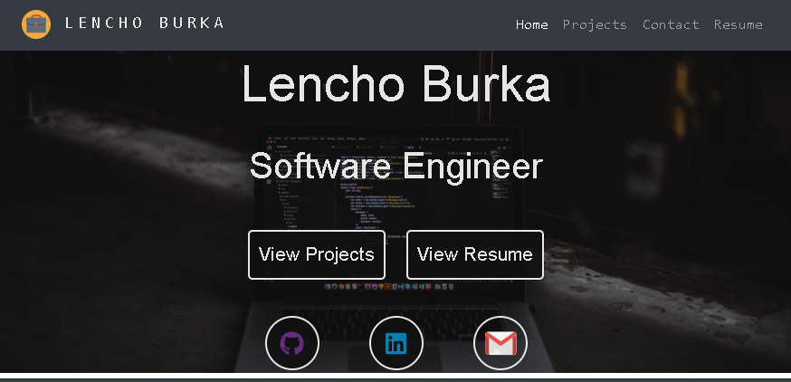

# [MyPortfolio](https://lenzoburger.github.io/MyPortfolio/home)

Personal Portfolio [Website](https://lenzoburger.github.io/MyPortfolio/home) - Angular 8

### Dependencies
1. [Node.js](https://nodejs.org/en/download) (v10+)
2. [AngularCLi (v8+)](https://cli.angular.io/) `npm install -g @angular/cli`
3. Up to date browser version with CSS GRID Support

### Clone & Run
1. Install dependencies
2. Clone repo `https://github.com/lenzoburger/MyPortfolio.git`
3. Change directory `cd MyPortfolio`
4. Restore app dependencies/_node-modules_ `npm install`
5. Run app: `ng serve --open`
6. Default browser should automatically launch at URL http://localhost:4200/

### Build & Deploy
_**Auto Commit & Deploy**_

1. Run: `"build&deploy-github.bat"`

_**Manual**_

1. In cmd/terminal run:`ng build --prod --base-href "https://lenzoburger.github.io/MyPortfolio/"`
2. Replace `<COMMIT MESSAGE>` and run `npx ngh --dir=dist/MyPortfolio --message="<COMMIT MESSAGE>"`

### Tools
1. [Git](https://git-scm.com/downloads)
2. [Visual Studio Code](https://code.visualstudio.com/download) & **Extensions:**
   * [_Angular Files_](https://marketplace.visualstudio.com/items?itemName=alexiv.vscode-angular2-files)
   * [_Angular Language Service_](https://marketplace.visualstudio.com/items?itemName=Angular.ng-template)
   * [_Angular Snippets_](https://marketplace.visualstudio.com/items?itemName=johnpapa.Angular2)
   * [_angular2-switcher_](https://marketplace.visualstudio.com/items?itemName=infinity1207.angular2-switcher)
   * [_Auto Rename Tag_](https://marketplace.visualstudio.com/items?itemName=formulahendry.auto-rename-tag)
   * [_Bracket Pair Colorizer 2_](https://marketplace.visualstudio.com/items?itemName=CoenraadS.bracket-pair-colorizer-2)
   * [_Debugger for chrome_](https://marketplace.visualstudio.com/items?itemName=msjsdiag.debugger-for-chrome)
   * [_Markdown All in One_](https://marketplace.visualstudio.com/items?itemName=yzhang.markdown-all-in-one)
   * [_Markdown Preview Enhanced_](https://marketplace.visualstudio.com/items?itemName=shd101wyy.markdown-preview-enhanced)
   * [_Meterial Icon Theme_](https://marketplace.visualstudio.com/items?itemName=PKief.material-icon-theme)
   * [_Path Intellisense_](https://marketplace.visualstudio.com/items?itemName=christian-kohler.path-intellisense)
   * [_Prettier - Code Formatter_](https://marketplace.visualstudio.com/items?itemName=esbenp.prettier-vscode)
   * [_TSLint_](https://marketplace.visualstudio.com/items?itemName=ms-vscode.vscode-typescript-tslint-plugin)
